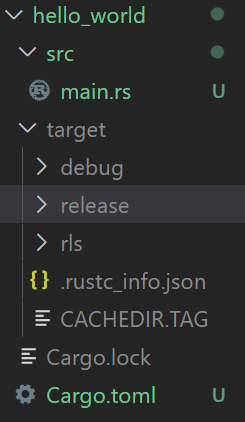

## Install

1. Download Visual Studio C++ build tools
2. https://www.rust-lang.org/tools/install Download and run the installer.
3. Verify in the command line `rustc --version`

## Hello, World!

Create a file named main.rs . Rust files containing source code always end with the extension.rs, and although not absolutely required here, it's common to name the primary source file, main. The requirement for source file names is that they do not contain spaces. So, if I wanted to name this file, hello, world, I can name it, hello_world. But for now let's stick with the convention of main.rs.

Every Rust program needs to have a top level function named `fn main()`. When we compile and run our program it will start by executing whatever code we put within the curly braces of this main function. If we don't include a main function, our program won't know where to begin execution. The parentheses after main are empty indicating the main function does not accept any inputs.

Syntax for adding comments in rust is similar to C/C++.

## Building programs using Cargo

Cargo is rust languages program manager.
- Manages dependencies for repeatable builds
- Downloads and builds external libraries
- Calls rustc with correct parameters
- Included with rustup installation

### Creating new project with cargo

Example: 
`cargo new hello_world`

It creates a new directory and populates with project files. It creates a src folder with main.rs file with a Hello, World! program. and a configuration file for this project called Cargo.toml.

### TOML: Tom's Obvious Minimal language

Contains packages and dependencies of the project.

### Compile and build project

- Go into the hello_world project which was crated using `cargo new hello_world`
- To build and run the project, run the command `cargo run`.This command will compile and build all parts of the program and then run it. And we can see the output from the default hello_world code in the terminal. 
- Notice that doing that also created a few additional things within our project directory. 
- `Cargo.lock` file is generated by cargo, it contains exact information about the project dependencies leave it alone and do not manually edit it. 
- The target folder contains the files that were generated from building the program. By default Cargo will build the program in debug mode which includes additional information for debugging. So the result goes into this directory named debug. 
- We can see that the debug directory contains the executable that was generated along with a bunch of other debug information. 
- After we are done developing and debugging our program and we are ready to build a final version of it for release, you can do that with the command `cargo build --release`. That builds the program with optimizations and the resulting output will go into the target release directory.

The cargo project hello_world contains the following structure.

