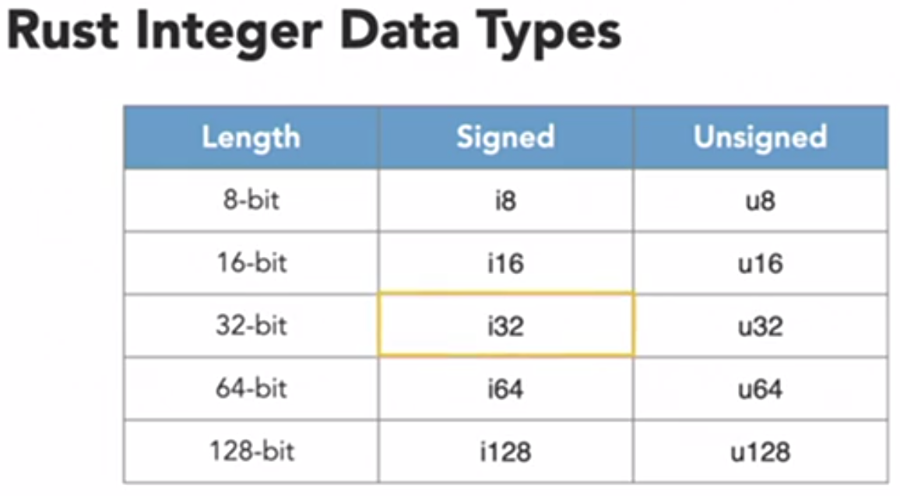
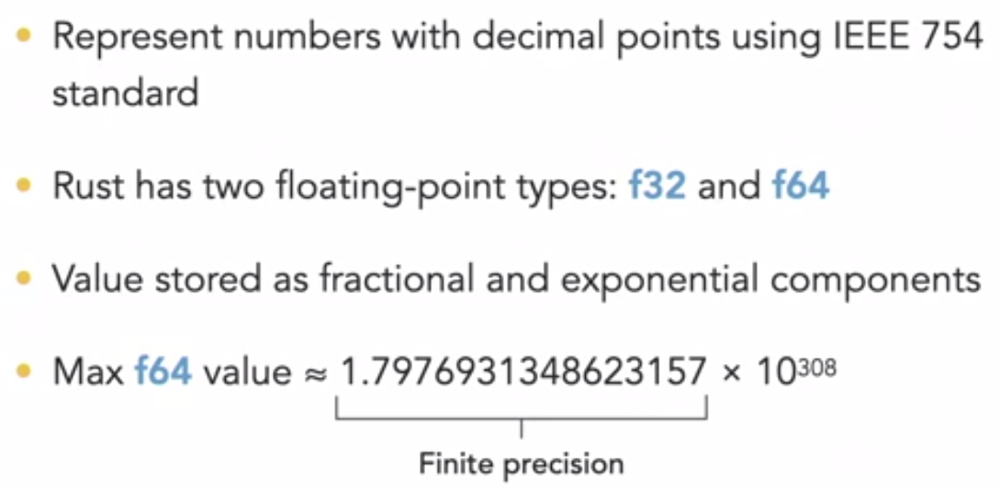
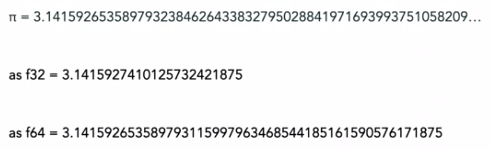
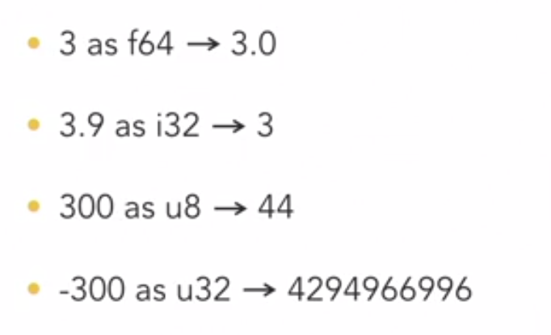

### Declaring Variables

- A variable can be declared with the use of keyword `let`. 
Ex: `let x = 10`

Following code will give error 

```rs
fn main() {
    let x = 10;
    println!("x is {}", x);
    x = 20;
    println!("x is {}", x);
}
```

Error Msg: 
```
|     x = 20;
|     ^^^^^^ cannot assign twice to immutable variable
```
> Rust variables are immutable by default

- Variables must be explicitly declared as mutable using `mut` keyword. 

```rs
fn main() {
    let mut x = 10;
    println!("x is {}", x);
    x = 20;
    println!("x is {}", x);
}
```
**Rust Naming Convention**

https://rust-lang.github.io/api-guidelines/naming.html

> Rust is a statically typed language i.e. all the variable data types must be known at compile time.

#### Rust scalar data types

- Integers
- Floating point
- Boolean
- Characters

### Integer data types

- Characterized by number of bits
- Unsigned --> only represent positive values
- Signed --> represent positive and negative values

Interger variable can have following interger data types. By default rust will assign signed int32.



Sepcifying the datatype in the program:
```rs
let x: u8 = 101;
```

When you try to assign a value out of the range of a given datatype, rust throws an error unlike c++, when the overflow value overflows in a cyclic manner.

Ex: 

```rs
fn main() {
    let mut x: u8 = 255;
    println!("x is {}", x);
    x = x+1; 
}
```

Error message: 
```
thread 'main' panicked at 'attempt to add with overflow', src\main.rs:4:9
note: run with `RUST_BACKTRACE=1` environment variable to display a backtrace
error: process didn't exit successfully: `target\debug\variables.exe` (exit code: 101)
```

### Floating point data types



Finite precision, Ex: representing Pi



By default when a variable is assigned a floating point value, rust stores it as f64. `let x =10.123`.

Explicitly it can be specified as `let x: f32 = 10.123`

### Arithmetic operations
- Addition: `+`
- Subtraction: `-`
- Multiplication: `*`
- Division: `/`
- Modulo: `%`

The following code will give an error:

```rs
fn main(){
    let a = 10;
    let b = 3.0;
    let c = a/b;
    println!("c is {}",c);
}
```

When we mix the data type we get a compiler error.

```
|     let c = a/b;
|              ^ no implementation for `{integer} / {float}`
|
= help: the trait `Div<{float}>` is not implemented for `{integer}`

error: aborting due to previous error

For more information about this error, try `rustc --explain E0277`.
error: could not compile `variables`
```

Rust will not determine the resulting data type when there is mixed data types in arithmetic operations. To avoid those error we can type cast a as float 64.

```rs
fn main(){
    let a = 10;
    let b = 3.0;
    let c = a as f64/b;
    println!("c is {}",c);
}
```
#### Casting

Type casting will lead to loss of data.When ever we type cast we need to know the consequences. Following are some of the examples of loss of data after type casting.



### Formating print statements

The control the numner of digits after the decimal point, one can use :. inside the curly braces.
Ex: `println!("c is {:.3}")` will print only first 3 decimal values.

To add leading space before the decimal values, we can add a value before `.`. if we need leading 0's, we add 0 followed by a value.

Ex:  `println!("c is {:04.3}")` will add leading zeros.

```rs
fn main(){
    let a = 10;
    let b = 3.0;
    let c = a as f64/b;
    println!("c is {}\nc is {:.3}\nc is {:8.3}\nc is {:08.3}",c,c,c,c);
}
```

### Bitwise operation


Output:
```
c is 3.3333333333333335
c is 3.333
c is    3.333
c is 0003.333
```